# Local reinforcement learning against fixed volt-var curves on a CIGRE MV feeder

A reproducible study of how far **local** control of PV inverters can go in keeping a
distribution feeder inside its voltage limits, and where it stops.

Nine PV units (6.44 MW) on the CIGRE European MV benchmark feeder push the far buses above
1.05 pu for about 200 hours of a simulated year. Every unit can hold that limit with the
volt-var curve of IEEE 1547-2018, but the standard's default curve is deliberately cautious
and pays for it in reactive energy and losses. The question here is whether an agent at each
inverter, seeing only its own bus, can learn to set its curve better, and how close that gets
to what a feeder-wide optimiser would do.

**Short answer: it beats the default curve comfortably, and it does not beat a well-chosen
fixed curve.** The information that is missing is not local.

Everything is in seven notebooks, in order, with their figures. Nothing is downloaded: the
network comes from the published CIGRE benchmark data, and the year of weather and load is
generated from a seed.

---

## Contents

1. [The result in one table](#the-result-in-one-table)
2. [The network](#1-the-network)
3. [The problem](#2-the-problem)
4. [A year of it](#3-a-year-of-it)
5. [What a curve can do about it](#4-what-a-curve-can-do-about-it)
6. [Turning the curve into a decision](#5-turning-the-curve-into-a-decision)
7. [Training](#6-training)
8. [What the agents learned](#7-what-the-agents-learned)
9. [Results over the year](#8-results-over-the-year)
10. [The fixed curve that wins](#9-the-fixed-curve-that-wins)
11. [Why local control stops there](#10-why-local-control-stops-there)
12. [The limit needs its own guard](#11-the-limit-needs-its-own-guard)
13. [A year nobody trained on](#12-a-year-nobody-trained-on)
14. [Files, reproducing, limitations](#files)

---

## The result in one table

Full simulated year, 15-minute steps, nine inverters, all controllers inside the adjustable
ranges of IEEE 1547 Category B:

| controller | hours outside 0.95-1.05 pu | losses (MWh) | reactive energy absorbed (Mvarh) | score |
|---|---|---|---|---|
| unity power factor | 199.75 | 383.7 | 0 | -31,328 |
| IEEE 1547 default curve (V3 1.02, V4 1.08) | 0 | 395.5 | 1,040 | -20,147 |
| tight curve (1.00, 1.04) | 0 | 453.1 | 4,272 | -35,380 |
| lazy curve (1.03, 1.10) | 0 | 387.4 | 294 | -16,836 |
| **best fixed curve + safety layer (1.03, 1.16)** | 0 | 385.8 | 202 | **-16,405** |
| learned, seed 0 / 1 / 2 | 0 | 386.4 / 385.6 / 386.6 | 372 / 310 / 266 | -17,112 / -16,828 / -16,695 |

The score is the objective the agents are trained on: voltage excess, losses, reactive power
and curtailment, weighted and summed over the year. Higher is better.

---

## 1. The network

The CIGRE European MV benchmark (CIGRE Technical Brochure 575, Section 6.2): 20 kV, 50 Hz,
two feeders from a 110/20 kV substation, built in OpenDSS from the published data and
validated against pandapower to five decimal places. Feeder 1, buses 1 to 11, carries the PV.

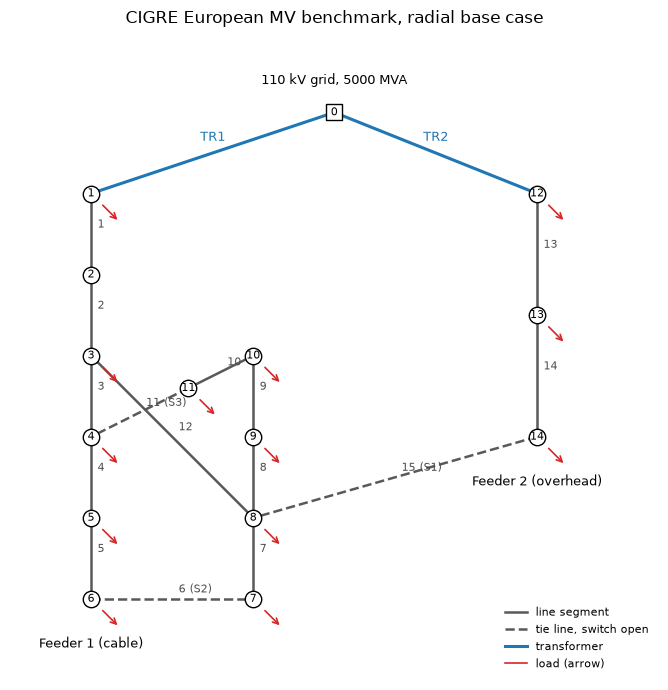

Buses 7 and 11 are the ends of the two laterals, the electrically weakest points, and they
are where every voltage problem in this study appears.

*Notebook: `01_feeder.ipynb`.*

## 2. The problem

Nine PV units of 680 to 740 kW sit at buses 3 to 11, 6.44 MW in total, with inverters rated
1.1 times their peak power. At full sun and light load the feeder voltage rises along its
length instead of falling, and the far buses pass 1.05 pu.

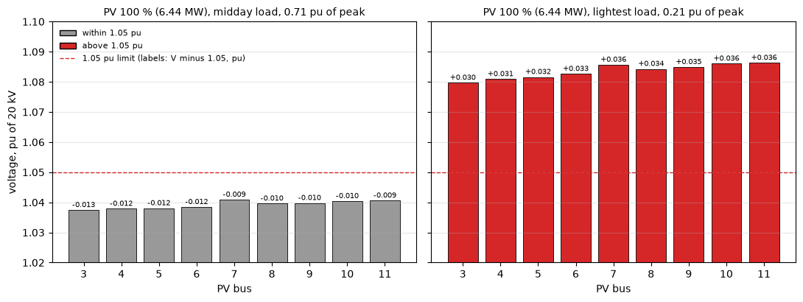

The transformer tap is first fixed at +4.375 %, chosen so that the feeder *without* PV stays
inside the band all year. Every violation after that is caused by PV, not by a bad tap.

*Notebook: `02_pv.ipynb`.*

## 3. A year of it

A snapshot cannot say how often this happens, so one year of 15-minute profiles is generated:
clear-sky geometry with a two-state Markov cloud model for the PV, and the brochure's daily
load shapes with seasonal, weekly and noise factors. Then every one of the 35,040 steps is
solved with the inverters at unity power factor.

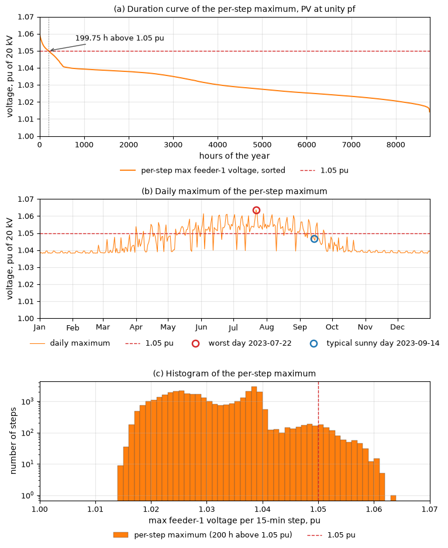

The result: **199.75 hours above 1.05 pu**, spread over 118 days from April to September, with
a maximum of 1.064 pu. Nothing ever goes below 0.95 pu. The problem is purely overvoltage, and
it is a midday, sunny-half-of-the-year problem.

*Notebook: `03_profiles.ipynb`.*

## 4. What a curve can do about it

IEEE 1547-2018 gives each inverter a volt-var characteristic: measure your own voltage, look
up how much reactive power to absorb or inject. Three fixed settings are compared, all legal
under Category B, plus a per-step optimal power flow that knows every bus voltage and serves
as the bound.

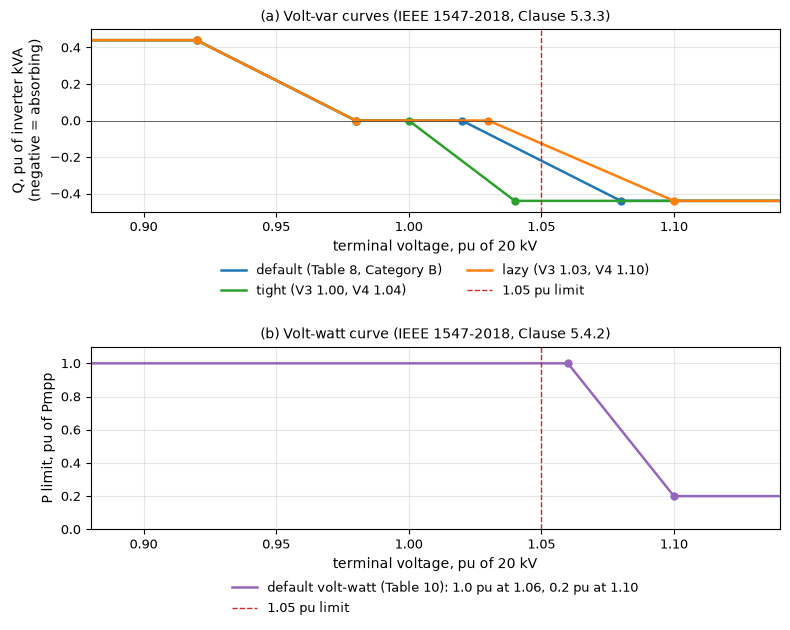

On the worst day of the year they behave very differently: the default curve absorbs reactive
power all day and holds the voltage far below the limit, while the optimiser waits, acts for
three hours around noon, and rides exactly along 1.05 pu.

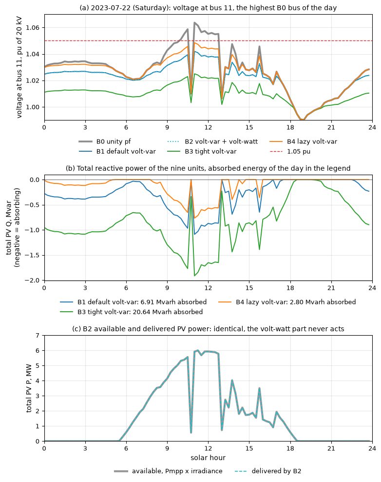

All three fixed curves hold the limit for the whole year. What separates them is cost: 1,040,
4,272 and 294 Mvarh of reactive energy. So the question is not *whether* the limit can be
held, but how cheaply.

*Notebook: `04_baselines.ipynb`.*

## 5. Turning the curve into a decision

The curve's upper half has three adjustable numbers: where absorption starts (V3), where it
reaches its maximum (V4), and how big that maximum is (Q4). An agent at each inverter sets
those three numbers every 15 minutes, from six local measurements: its own voltage, its own P
and Q, the time of day, and the irradiance.

Two things make this safe and fair:

- **A safety layer** ("the fence"). Before a step is scored, if any bus would leave
  0.95-1.05 pu, the layer computes the voltage sensitivities and adds the smallest extra
  absorption that brings it back, curtailing active power only if reactive power is not
  enough. Its use costs the agent reward.
- **One shared reward** for all nine units: voltage excess, losses, reactive power,
  curtailment.

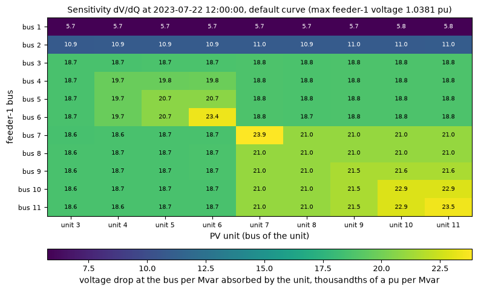

The sensitivity matrix above is what the safety layer measures: how much each bus voltage
moves per kvar from each unit. Note the off-diagonal terms — a unit changes its neighbours'
voltage almost as much as its own, which is exactly why nine units acting on their own
information is a hard problem.

*Notebook: `05_environment.ipynb`.*

## 6. Training

Soft actor-critic, with one actor and one critic pair shared by all nine units and a one-hot
unit identity appended to the six observations. Each step produces nine transitions, so the
nine units share their experience while still acting on their own measurements.

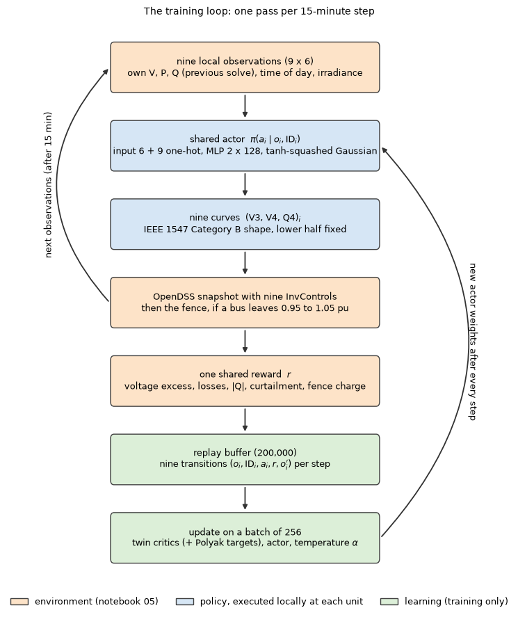

Three seeds, 500 single-day episodes each, drawn from 120 days of the year, about 10 minutes
per seed on a CPU. The full year is evaluated every 50 episodes and the best checkpoint kept.

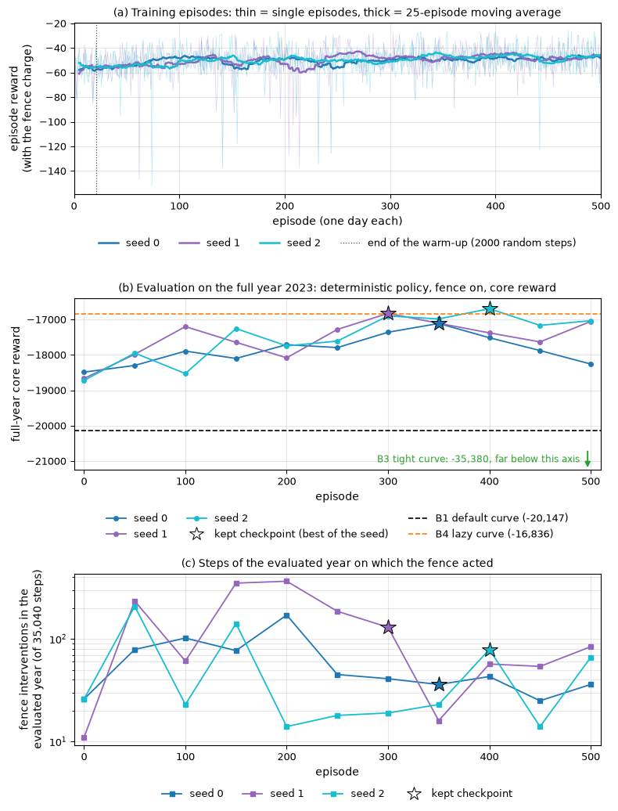

Note that the year score is not monotonic: the policy at the end of training is worse than the
best checkpoint in all three seeds. Which moment you keep matters as much as the training.

*Notebook: `06_train.ipynb`.*

## 7. What the agents learned

Each learned curve is redrawn every 15 minutes, so the figure shows them as a distribution
over all daylight steps of the year: the median and the spread.

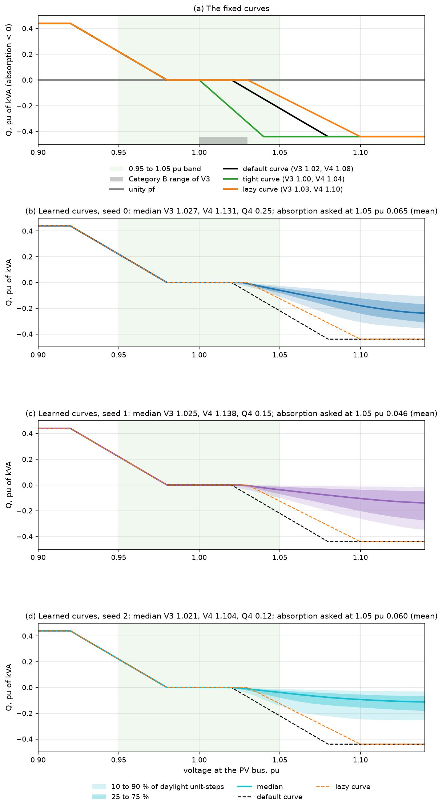

They are **milder than the standard's default curve**, and above 1.05 pu milder than the
hand-set lazy curve too. At 1.05 pu they ask for 0.05 to 0.07 pu of kVA, where the lazy curve
asks 0.13 and the default 0.22. Every learned curve stays inside the standard's adjustable
ranges.

## 8. Results over the year

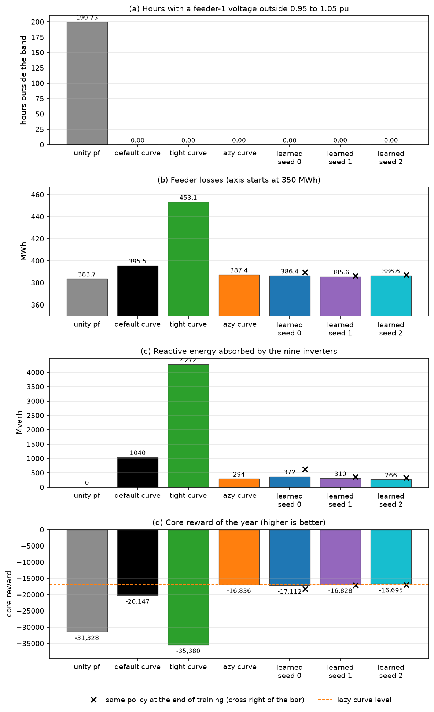

Every controller except unity power factor holds the limit for the whole year, so the contest
is about cost. The agents have the lowest losses of any curve and cut the default curve's
reactive energy by 64 to 74 %. Against the hand-set lazy curve they are level: one seed better,
two worse.

The black crosses are the same policies at the end of training. All three are worse than the
lazy curve.

## 9. The fixed curve that wins

If the agents only tie a curve we picked by hand, the obvious question is whether that hand
pick was lucky. So fifteen fixed curves were swept over the full year, each run twice: once
alone, and once with the same safety layer the agents use.

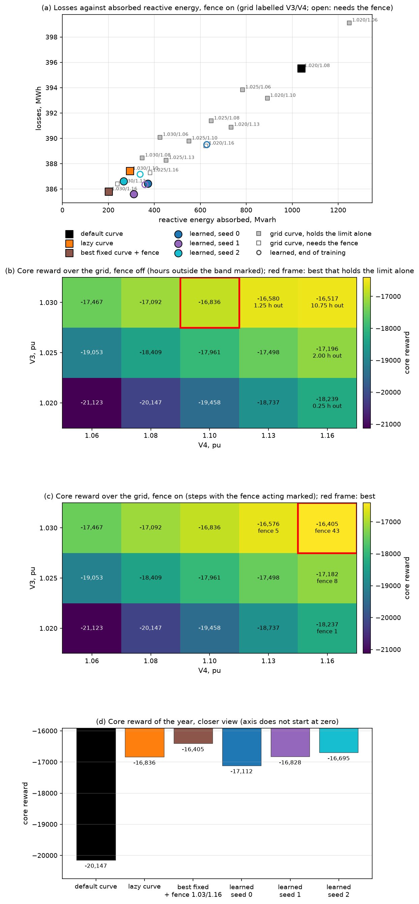

Two findings:

- **Alone**, the best curve that actually holds the limit is the hand-set one (V3 1.03,
  V4 1.10). Milder curves score higher but break the limit, for up to 10.75 hours a year.
- **With the safety layer**, the mildest curve of the sweep (V3 1.03, V4 1.16) scores -16,405
  and beats all three learned policies, needing the layer on only 43 steps of the year.

Panel (a) shows why: every controller, fixed or learned, sits on one line where losses fall as
reactive energy falls. The agents' time-varying curves do not reach a point a fixed curve
cannot.

## 10. Why local control stops there

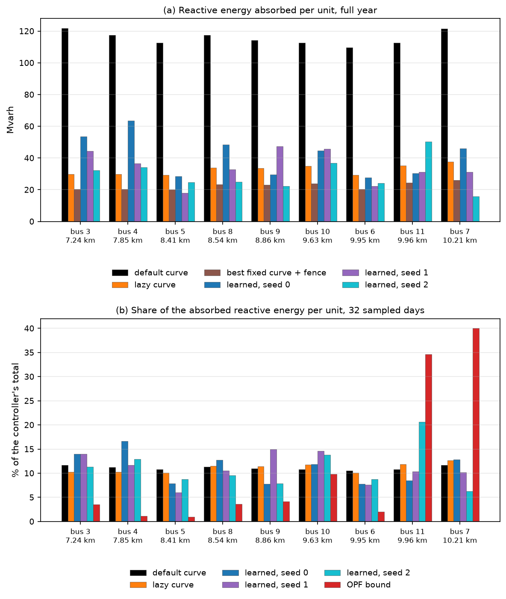

The per-step optimiser places **85 % of its reactive absorption at buses 7, 10 and 11**, the
far ends, where a kvar moves the critical voltage most. Every local controller spreads it
roughly evenly, 33 to 41 %.

A unit cannot read this from its own terminal voltage. Two pieces of information are missing
and both belong to the feeder, not the inverter: whether the limit is at risk at all right
now, and which units move the critical bus. On an ordinary sunny day the correct action is to
do nothing — the optimiser does exactly nothing and scores the no-control result — and no
local unit can know that either.

## 11. The limit needs its own guard

The agents' zero violation hours are a joint result of policy and safety layer. Switch the
layer off and the same policies leave the band for 9.5, 33.25 and 21.0 hours a year.

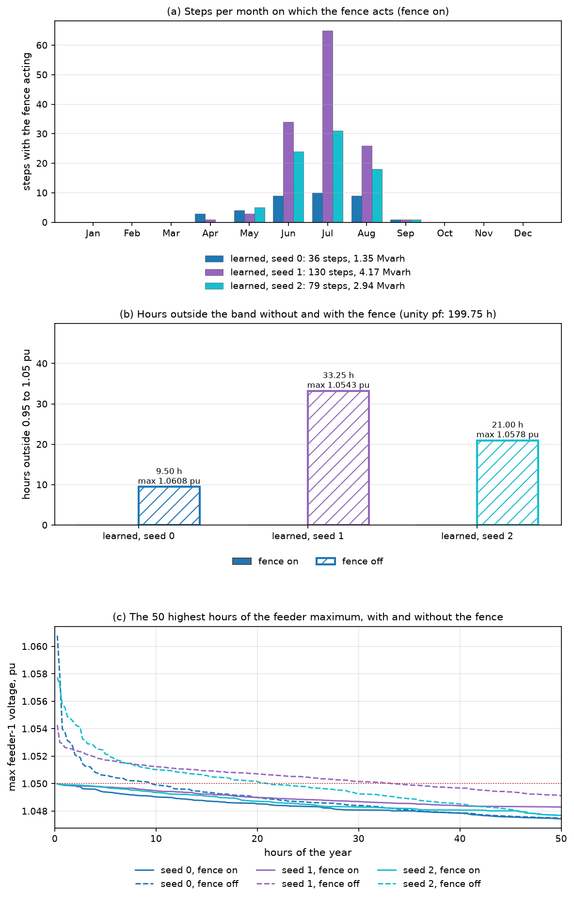

The reason is in the objective: a small breach for one step costs less reward than the
reactive power that would prevent it. Under a penalty-based reward the limit cannot be left to
the objective. The milder fixed curves behave the same way. A layer that enforces the limit is
part of the controller, not an accessory.

## 12. A year nobody trained on

The checkpoints were chosen by scoring on the same year they were trained in, which flatters
them. So a second year was generated with a different seed — different clouds, different load
noise, same climate — and everything was rerun on it.

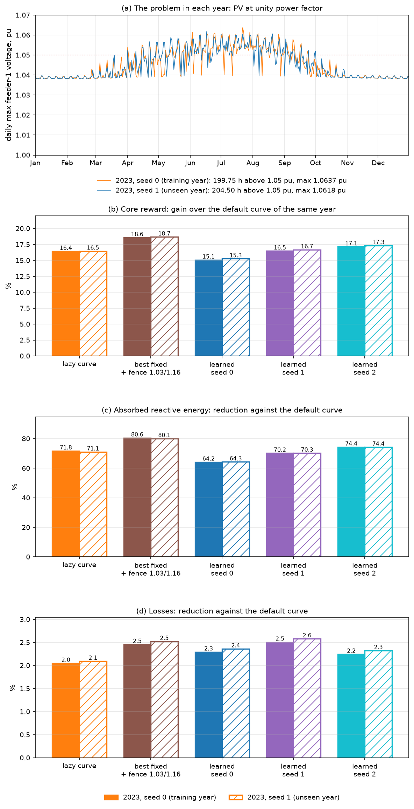

Nothing moves. Every margin changes by at most 0.2 points, and the ranking is identical in
both years: best fixed curve + safety layer, then seeds 2, 1, the lazy curve and seed 0, then
the default curve.

---

## Files

| notebook | what it does |
|---|---|
| `01_feeder.ipynb` | the CIGRE European MV feeder in OpenDSS, validated against pandapower and the source brochure |
| `02_pv.ipynb` | nine PV units, the transformer tap, where and when overvoltage appears |
| `03_profiles.ipynb` | one synthetic year of PV and load at 15 minutes, and a screening of every step |
| `04_baselines.ipynb` | fixed volt-var curves, volt-watt, and a per-step OPF as reference |
| `05_environment.ipynb` | the learning environment: observations, actions, reward, safety layer |
| `06_train.ipynb` | soft actor-critic with one shared actor for nine units, three seeds |
| `07_results.ipynb` | all of it compared, plus the fixed-curve sweep, the safety-layer test and the unseen year |

Modules: `cigre_dss.py` (feeder), `profiles.py` (PV and load models), `simulate.py` (year runs,
OPF), `kpi.py` (metrics), `env.py` (environment and safety layer), `agents.py` (SAC).
Figures are in `figures/`, headline numbers in `results_summary.json`, trained policies in
`models/`.

## Reproducing

```bash
pip install opendssdirect.py numpy pandas scipy matplotlib h5py torch pandapower jupyter
```

Run the notebooks in order; each writes the files the next one reads. Tested with Python 3.11,
opendssdirect.py 0.9.4 (DSS C-API 0.14.5), numpy 2.4.6, pandas 2.3.3, scipy 1.16.3, h5py 3.16,
matplotlib 3.11, torch 2.14 (CPU) and pandapower 3.5.4, the last used only to validate the
feeder in notebook 01.

Everything runs on a CPU. Notebook 06 takes about 30 minutes for three seeds and notebook 07
about 14 minutes; the rest take minutes or less. The large intermediate result files
(`train_2023.h5`, `baselines_2023.h5`, `env_checks_2023.h5`) are not tracked here: they are
regenerated by running notebooks 04, 05 and 06.

## Limitations

Synthetic profiles from a simple weather model; one feeder and one PV penetration; balanced
positive-sequence power flow every 15 minutes, with no dynamics, unbalance, measurement noise
or communication delay; a fixed transformer tap and no other voltage-control device; a safety
layer that uses the exact network model; three training seeds, whose spread is as wide as some
of the differences being compared; and one particular choice of reward weights, whose voltage
term is weak enough to rank some limit-breaking curves highly.

One modelling detail is worth naming, because it costs the agents dearly: the simulated
inverters keep their reactive capability at zero PV output, so a curve whose knee sits below
the night-time voltage absorbs all night. That is 479 of the default curve's 1,040 Mvarh, and
58 to 174 Mvarh of the learned policies'. Many real inverters disconnect below a minimum
power. Section 13 of `07_results.ipynb` states all of this in full.

## Where this goes next

The gap that local control cannot close is about the feeder, not the inverter: whether the
limit is at risk at all right now, and which units move the critical bus. Both are visible at
the substation. A slow feeder-level coordinator could pass them down as a small signal, such as
a per-unit budget, a shift of the curve's knee, or simply "act now" and "stand down", while the
fast decisions stay local and the shape of the standard's curve is kept. Whether such a
coordinator closes the remaining gap, and how it behaves when its messages are delayed or lost,
is the natural continuation.

## License

MIT, see `LICENSE`. The benchmark data in `data/` are derived from the published CIGRE
Technical Brochure 575 description of the European MV network.

## Citation

Bhattarai, P. (2026). *Local reinforcement learning against fixed volt-var curves on a CIGRE
MV feeder.* Software and notebooks.
